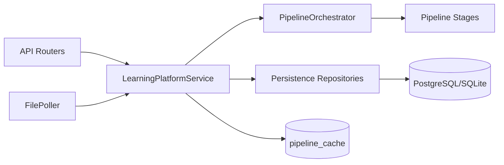

# learning_platform Module

The `learning_platform` module provides document ingestion, pipeline processing,
knowledge extraction, and study-plan generation as a FastAPI sub-application.

## What This Module Owns

- Authenticated document upload and processing endpoints.
- Pipeline orchestration from parser -> normalizer -> enrichment -> unit,
  concept, graph, and sequence generation.
- Persistence of canonical document outputs and pipeline logs.
- Background poller for queued processing (`lp_document_process`).

## Architecture Entry Points

- LP app factory: `learning_platform/src/learning_platform/api/app.py`
- Main app mount point: `src/main.py` (`app.mount("/lp", get_lp_app())`)
- Orchestration service: `learning_platform/src/learning_platform/service.py`
- Pipeline orchestrator: `learning_platform/src/learning_platform/pipeline/orchestrator.py`

See detailed architecture notes: `learning_platform/docs/architecture-notes.md`.

## API Surface

When mounted by the main app, LP endpoints are available under `/lp`.

- `GET /lp/health`
- `GET /lp/api/courses/`
- `POST /lp/api/documents/upload`
- `POST /lp/api/documents/{doc_id}/process`
- `POST /lp/api/documents/{doc_id}/enrich`
- `GET /lp/api/documents/{doc_id}/tree`
- `GET /lp/api/documents/{doc_id}/units`
- `GET /lp/api/documents/{doc_id}/concepts`
- `GET /lp/api/documents/{doc_id}/study-plan`
- `GET /lp/api/documents/{doc_id}/export/json`

## Configuration

Primary settings live in `learning_platform/src/learning_platform/config.py`.

Important variables:

- `ENVIRONMENT`
- `DATABASE_URL`
- `UPLOAD_PATH`
- `JWT_SECRET`
- `S3_ACCESS_KEY`, `S3_SECRET_KEY`, `S3_BUCKET`
- `LLM_PROVIDER`, `LLM_MODEL`, `LLM_BASE_URL`
- provider-specific keys (`OPENAI_API_KEY`, `ANTHROPIC_API_KEY`)

Non-test environments fail fast when required secrets/config are missing.

## Runbook

### Load test environment

From repo root:

```bash
set -a
source .env.testing
set +a
```

This exports LP variables (including `DATABASE_URL`) for test-safe operations.

### Start LP module only

From repo root:

```bash
./learning_platform/start_lp.sh --testing
```

### Start main app (with LP mounted)

From repo root:

```bash
uv run fastapi dev src/main.py --port 5000
```

### Quality checks

```bash
uv run ruff check learning_platform
uv run ruff format learning_platform
uv run pytest learning_platform/tests
```

### Migrations

Use the migration wrapper script:

```bash
./scripts/migrate.sh testing
./scripts/migrate.sh production
./scripts/migrate.sh
```

Expected result:

- Migrations apply successfully for the selected environment(s).

Optional validation commands:

```bash
DATABASE_URL="$(uv run python -c "from dotenv import dotenv_values; print((dotenv_values('.env.testing').get('DATABASE_URL') or '').strip())")" uv run python scripts/check_migrations.py --check-current
DATABASE_URL="$(uv run python -c "from dotenv import dotenv_values; print((dotenv_values('.env.testing').get('DATABASE_URL') or '').strip())")" uv run python scripts/migration_smoke_test.py
```

## Dependency Map



## ADRs

- `learning_platform/docs/adr/ADR-0001-pipeline-orchestration.md`
- `learning_platform/docs/adr/ADR-0002-persistence-and-schema-governance.md`
